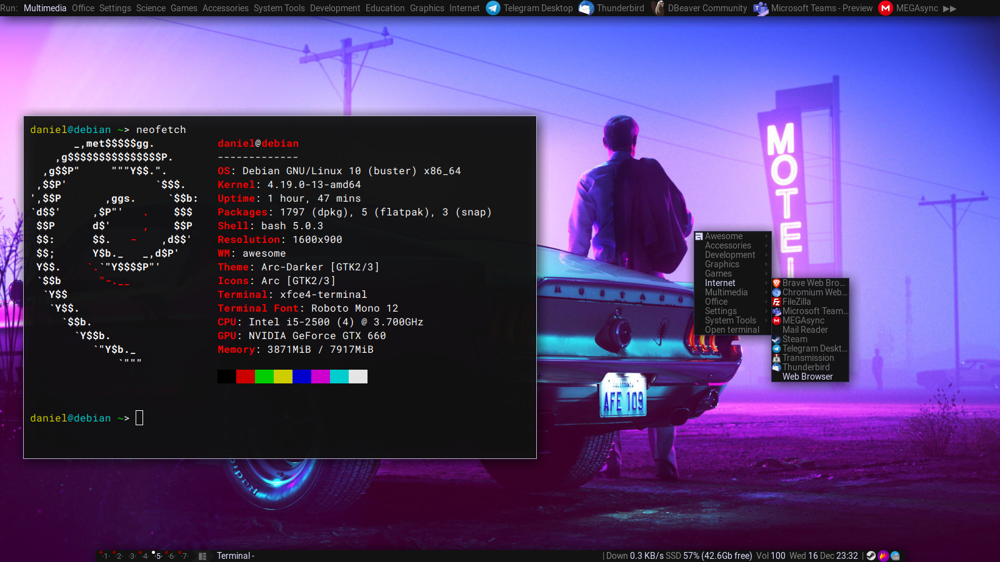
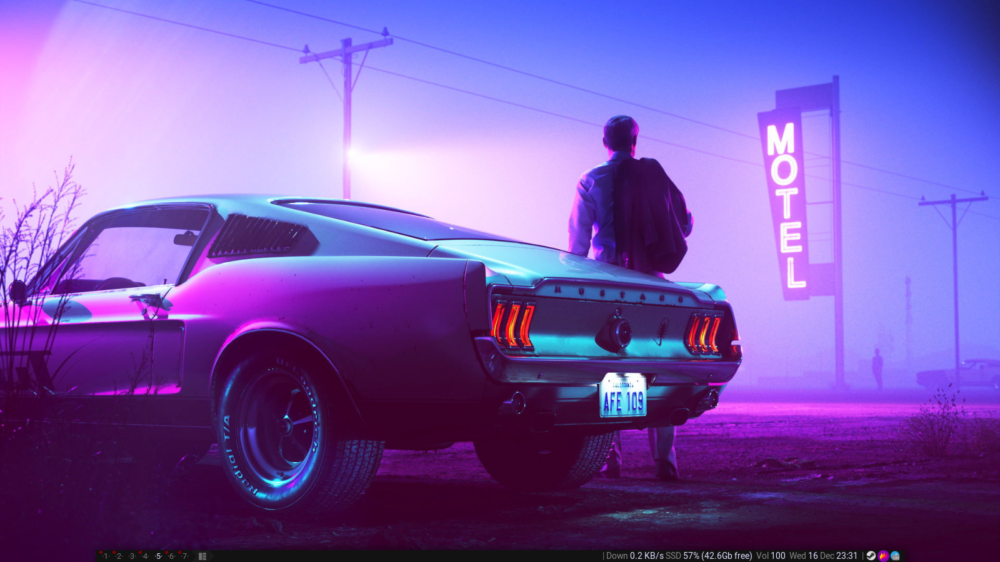
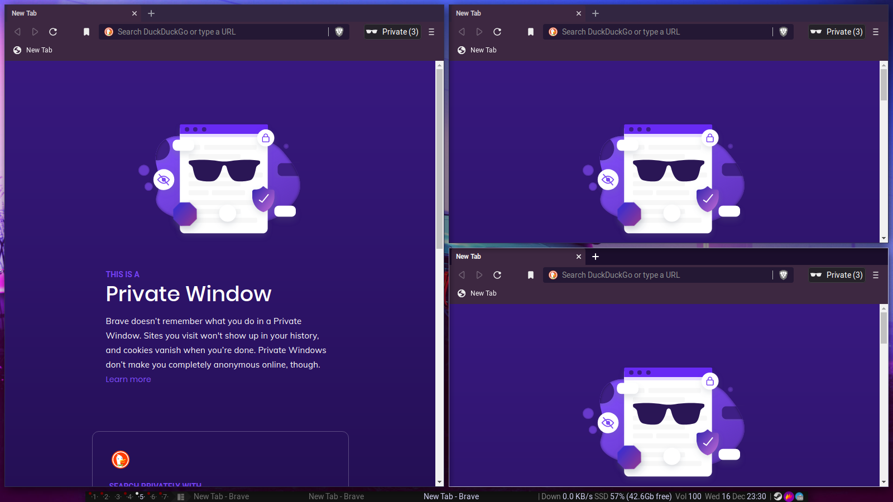

# My configuration files of AwesomeWM

- Theme: Dremora from https://github.com/lcpz/awesome-copycats with some modifications.
- Wallpaper: https://steamcommunity.com/sharedfiles/filedetails/?id=2271035581

- Cursor-theme: macOSBigSur → https://github.com/ful1e5/apple_cursor
- Font-family: Roboto → https://fonts.google.com/specimen/Roboto
- Gtk-theme: Arc-theme from → https://github.com/horst3180/Arc-theme
- Icon-theme: Arc-icon-theme → from https://github.com/horst3180/arc-icon-theme

### Screenshots

